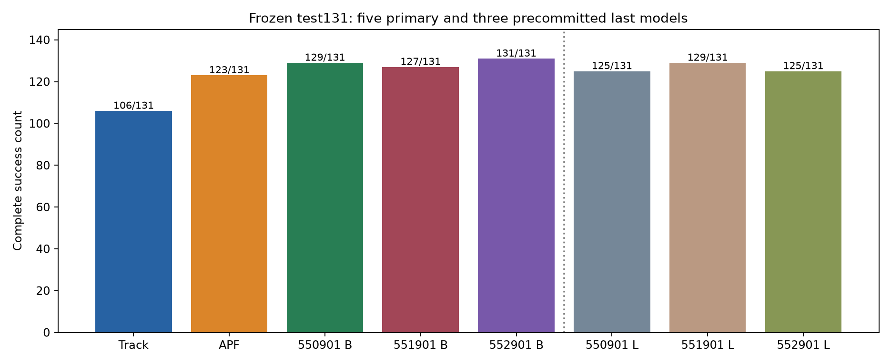

# Panda 强化学习姿态控制

固定基座 Franka Panda 七自由度机械臂在静态球形障碍物附近，按 4 秒固定时钟完成短直线位置轨迹。传统 DLS 位置控制器负责跟踪，APF 或 PPO 提供七维辅助关节姿态指令，通过带阻尼的近似零空间投影合成控制。PPO 学习的是辅助姿态，工具朝向不受控。

物理与安全检测 240 Hz，姿态策略 48 Hz；观测 91 维、动作 7 维。数据版本 `me5418-scenes-v1`，train/validation/test 为 151/58/131。三个正式种子各训练 1,024,000 步，共 3,072,000 步。

| 方法 | 完整成功 / 131 | 角色 |
| --- | ---: | --- |
| tracking | 106 | 基线 |
| APF | 123 | 基线 |
| PPO best 550901 / 551901 / 552901 | 129 / 127 / 131 | 三个主要结果 |
| PPO last 550901 / 551901 / 552901 | 125 / 129 / 125 | 三个预先约定的补充结果 |

三个 best 在当前固定集合中都高于 APF，但部分 seed 的命令平滑度和速度代价更大；更长训练不保证更好。没有未来参考输入的独立消融、实机部署、通用安全或严格实时保证。test 已使用，本次重新运行属于复现与回归核对。



## 最短运行

需要 Linux x86_64 和 Python 3.11（本次实际版本 3.11.16）。私有仓库访问需要相应 GitHub 账户权限。

```bash
git clone https://github.com/linkhow/panda-rl-posture-control.git
cd panda-rl-posture-control
bash scripts/install_cpu.sh python3.11
bash run.sh quick_check --output quick_001
```

安装脚本新建仓库自己的 `.venv`，使用官方 PyTorch 2.13.0+cpu 和锁定依赖，不向已有环境安装包。没有 `python3.11` 命令时，将脚本末尾参数换成已有 Python 3.11 解释器路径；详见[安装说明](docs/environment_zh.md)。快速检查会核对结果、加载六个模型并重放五个成功/失败代表案例；失败案例按原失败复现也是检查通过。

```bash
# 八方法、同131场景，共1048个新评价回合
bash run.sh evaluate --workers 4 --output fixed131_001
# 分析新结果及共同完整成功子集的运动代价
bash run.sh analyze --input outputs/fixed131_001/episodes_all1048.csv --output analysis_001
# 短训练，仅检查采样、PPO更新和保存/重载
bash run.sh train --smoke --output train_smoke_001
# 从头正式训练：单seed或三个seed顺序运行
bash run.sh train --seed 550901 --output train_seed550901_001
bash run.sh train --all-seeds --output train_all_three_001
```

新输出全在 `outputs/`，已存在目录拒绝覆盖。完整训练命令提供，本次整理只执行短训练。best 按全部 58 个 validation 场景的事先规则选择，六个保存模型的主次角色不随 test 分数改变。

## 阅读与文件入口

- [中文项目总结](docs/project_summary_zh.md)：任务、公式、模块、开发调整、结果、失败与局限。
- [运行与复现](docs/reproduction_zh.md)、[训练说明](docs/training_zh.md)：准确命令、输出、选择规则和资源。
- [实际验证记录](docs/verification_zh.md)：独立环境、六模型、五代表、短训练和完整评价的实测。
- [后续优化边界](docs/future_work_zh.md)：新分支、配置、输出与未见评价数据要求。
- [来源与助手辅助](docs/third_party_and_assistance_zh.md)、[复制来源](provenance/copy_sources.json)：如实说明复用和整理；未自行选择开源许可证。
- `models_index.json`：六模型角色、原档案 SHA、发布 ZIP SHA、配置与选中步数。
- `datasets/me5418-scenes-v1/`：340个场景参数和固定 split；`results/reference/`：保存的正式结果。
- `references/`、`media/`：五个代表状态对照、必要图表和三段既有演示视频。

训练与评价只使用场景参数，不读取离线动作见证。完整可行性见证、历史模型、全部原始轨迹、个人学习/求职资料和旧 Stage11 整包不在仓库中；范围见[上传清单](docs/upload_plan_zh.md)。模型 ZIP 仅将旧 TensorBoard 路径元数据设为 null，权重、优化器和张量成员字节不变，证据见[模型元数据处理](provenance/model_metadata_sanitization.json)。

本机新 CPU 环境与发布目录独立运行已验证；从 GitHub 新 clone 的文件核对与六模型/五例快速验证通过；跨机器尚未验证。后续开发从这个仓库的新分支继续，原正式结果保持可追溯。
