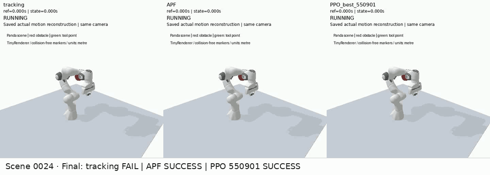
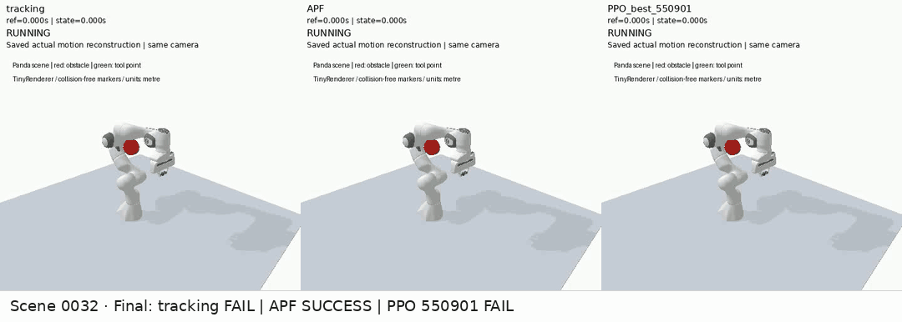
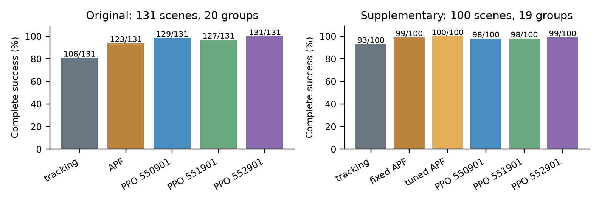

# Panda RL Posture Control

[English](README.md) | [简体中文](README.zh-CN.md)

## Overview

A Franka Panda arm follows a timed 3D straight line while changing its joint configuration around a static sphere. A traditional Jacobian controller handles tool-position tracking; artificial potential fields (APF) or PPO provide an additional posture command.

All methods share the same tracker, motors, limits and collision checks. Here, **posture means joint configuration**, not tool orientation. The task uses a fixed base, fixed fingers and a four-second reference trajectory in PyBullet.

## Demos

**Tracking fails; APF and PPO succeed** — original scene `0024`, PPO seed `550901`.



**APF succeeds; PPO fails** — original scene `0032`, PPO seed `550901` fails at about 0.496 s.



These animations come from the existing videos reconstructed from saved joint states. Red is the obstacle; green is the tool point. Failed runs remain frozen after termination. [Full-resolution videos](media/videos).

## Method

- **Position tracking:** a quintic time profile gives smooth starts and stops. A damped least-squares Jacobian controller tracks the reference tool position.
- **Posture adjustment:** tracking alone uses `u = 0`. APF derives a seven-joint velocity command from surface distances and joint limits. PPO predicts the same seven-dimensional command from a 91-dimensional motion and geometry observation.
- **Shared execution:** the posture command is bounded to ±0.2 rad/s and passed through an approximate null-space projection before being added to tracking. Posture updates run at 48 Hz; motor execution and safety checks run at 240 Hz. Damping means the projection is not perfectly task-neutral.

PPO learns the posture component, rather than replacing the position controller. A complete success requires the full four-second motion, at most 1 cm tracking error throughout, and no collision-band or joint-limit failure.

## Results

The two evaluation sets are reported separately. PPO rows use the three **validation-selected best checkpoints**; no model was reselected using these results.

| Method | Original set · 131 scenes | Stage12 supplementary set · 100 scenes |
|---|---:|---:|
| Tracking only | 106/131 | 93/100 |
| Fixed APF | 123/131 | 99/100 |
| Validation-tuned APF | Not evaluated | 100/100 |
| PPO · seed 550901 | 129/131 | 98/100 |
| PPO · seed 551901 | 127/131 | 98/100 |
| PPO · seed 552901 | 131/131 | 99/100 |



PPO completes more original scenes than fixed APF, while tuned APF has the highest success count on the supplementary set. Its parameters were selected on the existing 58-scene validation set and frozen before supplementary scene generation.

The supplementary set has a different geometry mix and was screened with APF-family feasibility witnesses. It is an additional evaluation within the developed task family, not an untouched benchmark. Some PPO seeds also incur higher command-variation and joint-speed costs. Collision-band failures remain; entering the +0.1 mm contact band does not necessarily mean negative penetration. These results do not establish statistical significance, general safety or real-robot performance.

Saved episode tables: [original](results/reference/episodes_all1048.csv) · [supplementary](stage12/results/episodes_new600.csv). The three `last` checkpoints remain available for stability comparisons; their original success counts are 125, 129 and 125/131. [Detailed metrics](stage12/analysis/README.md).

## Installation

Use Linux x86_64 with Python 3.11 and `venv` support. CPU execution is sufficient; CUDA is not required. The installer creates `.venv` and installs the pinned dependencies, including PyTorch from its official CPU wheel index.

```bash
git clone https://github.com/linkhow/panda-rl-posture-control.git
cd panda-rl-posture-control
bash scripts/install_cpu.sh python3.11
```

[Environment details](docs/environment_zh.md).

## Usage

Read the saved results without running simulation, then reproduce one success and one expected failure:

```bash
bash run.sh check_results
bash run.sh demo --case learning_success --method PPO_best_550901 --output demo_success
bash run.sh demo --case apf_success_learning_failure --method PPO_best_550901 --output demo_failure
```

Train from scratch with the fixed configuration, or evaluate the six pretrained checkpoints and two baselines on the original set:

```bash
# Three seeds, 1,024,000 interactions each; selects best using validation only.
bash run.sh train --all-seeds --output training_run

# Eight methods × 131 scenes; writes new results and compares with the saved reference.
bash run.sh evaluate --workers 4 --output evaluation_original131
```

Outputs go under `outputs/`; existing names are refused. Training and full evaluation require time and disk space. Use `--help` for options. For the supplementary APF experiment, use the [reference-preserving reproduction instructions](docs/stage12_reproduction_zh.md).

## Repository structure

```text
me5418/        Scene, tracking controller, APF and Gymnasium environment
configs/       Frozen physics, control and PPO settings
datasets/      Original scene parameters and train/validation/test splits
models/        Three best and three last PPO checkpoints
tools/         Demo, training, evaluation and result-checking entries
stage12/       Tuned APF, supplementary scenes and saved results
media/         GIFs, videos and figures
docs/          Installation, reproduction and technical notes
run.sh         Common command entry
```

## References

- [PyBullet](https://github.com/bulletphysics/bullet3) — simulation, collision queries and the bundled Panda model.
- [Gymnasium](https://gymnasium.farama.org/) — environment interface.
- [Stable-Baselines3 PPO](https://stable-baselines3.readthedocs.io/en/master/modules/ppo.html) and [PyTorch](https://pytorch.org/) — learning implementation.
- [Schulman et al., *Proximal Policy Optimization Algorithms*](https://arxiv.org/abs/1707.06347).
- [Third-party sources and assistant-assisted implementation](docs/third_party_and_assistance_zh.md).
