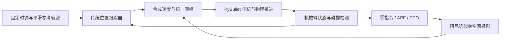

# 项目总结：Panda 机械臂定时跟踪与姿态避障

这个项目研究一个具体问题：机械臂末端必须按既定时间走完短直线，但它的手臂连杆也要避开旁边的障碍物。共享的传统控制器负责末端位置跟踪，人工势场或强化学习负责调整关节构型。PPO 学习的是七维辅助姿态指令，并没有学习整套机械臂控制器。

当前已完成仿真、控制与环境实现、固定数据划分、开发对照、三种子正式训练和 131×8 次统一测试。当前仓库提供保存结果检查、六个冻结模型加载、代表演示、固定模型全量评估，以及从头训练入口。安装与本次复现的实际验收状态见[复现说明](reproduction_zh.md)；本报告描述原正式实验的技术结果。

## 1. 项目要解决的任务

机器人是固定基座 Franka Panda，有七个手臂关节。工具点是 `panda_grasptarget` 连杆原点；双指固定在各 0.02 m 的位置。任务是让工具在 4 s 内移动 3–8 cm，轨迹是世界坐标中的直线，并在全过程保持位置误差不超过 1 cm。

场景中有一个静态球形障碍物。除了避免球与机器人接触，还要监测规定的自碰撞对、硬关节限位、实际关节速度和非有限状态。这里的“姿态”指关节构型，工具朝向没有作为控制目标。

## 2. 为什么需要调整机械臂姿态

末端走对了，不代表整条手臂不会撞到障碍物。末端只需要满足三个位置方向的要求，七个关节通常仍有调整空间：可以让肘部或腕部绕开球，同时尽量保持工具的位置运动。

项目把这部分调整放在近似零空间中。所谓零空间，是对末端位置速度影响较小的关节运动方向。由于这里使用阻尼逆，投影并不精确，辅助运动仍可能影响主任务；代码记录这种“泄漏”，并继续检查实际位置误差。

## 3. 整体方案与模块分工

| 模块 | 实际职责 | 代码入口 |
| --- | --- | --- |
| 场景与检测 | 加载模型、名称映射、工具点、外部和自碰撞距离 | `me5418/scene.py` |
| 轨迹 | 以固定时间生成平滑起停的直线参考 | `me5418/trajectory.py` |
| 主任务控制 | 雅可比、阻尼最小二乘、投影、速度和软边界限制 | `me5418/tracking.py` |
| APF 姿态 | 根据真实表面距离产生避障和关节限位指令 | `me5418/posture.py` |
| 共享执行 | 真实电机推进、时钟、安全检查、统一指标 | `me5418/evaluation.py` |
| 学习环境 | Gymnasium 接口、观测、奖励和终止 | `me5418/arm_env.py`、`diagnostic_env.py` |
| 类别采样 | 训练时先选几何类别，再在类别内均匀选场景 | `me5418/sampling.py` |
| 冻结评价 | 确定性模型适配、原始动作剪裁和完整外层计时 | `me5418/final_evaluation.py` |

物理推进、主任务控制与安全检测为 240 Hz。APF 或 PPO 的辅助指令为 48 Hz，每次保持最多五个物理步；失败发生时立即结束剩余子步。所有方法使用同一套实际电机、参考时钟和安全条件。

## 4. 仿真场景、输入、动作与成功条件

仿真使用 PyBullet 的 Panda URDF，重力为 `[0,0,-9.81]` m/s²，步长为 1/240 s，求解器迭代数为 100。基座通过 `useFixedBase=True` 固定。画面中的地面仅作视觉显示，没有碰撞形状，也不提供支撑力。监测的自碰撞对经过固定过滤，共 45 对。

场景参数包含初始关节角、双指位置、球的位置和半径、轨迹位移、时长及执行条件。训练和评估从这些参数创建场景；策略不读取离线见证动作，不使用场景 ID、split 或成功答案作为观测。

每个回合先经过 240 步实际电机稳定，再从实际工具位置定义起点。完整成功需要走完 4 s，且全过程没有任务失败。普通成功有 192 次策略动作、960 个跟踪物理步和 961 行跟踪状态。正常运动期间禁止用 `resetJointState` 直接改关节来代替电机。

碰撞指标必须分别理解：

| 指标 | 判定 | 含义 |
| --- | --- | --- |
| 接触带失败 | 表面有符号距离 `d ≤ +0.1 mm` | 包含很接近但仍为正距离的状态 |
| 任意负距离 | `d < 0` | 单独保留微小负值 |
| 明确穿透 | `d < −0.1 mm` | 使用项目规定的容差界限 |
| 普通缓冲预警 | 距离进入 30 mm 缓冲 | 记录预警，不直接判失败 |
| 查询范围外 | 距离大于 0.3 m | 记录为 `null` / censored，不能当成无限远 |

失败回合在首次违规处结束，终点误差为 `null`，不能把这种提前结束算成完整成功。

## 5. 传统跟踪、APF 与 PPO 如何工作

**平滑参考。** 令 `τ=t/T`，`T=4 s`，直线路径为：

\[
p_d(t)=p_0+(10\tau^3-15\tau^4+6\tau^5)(p_g-p_0).
\]

`p_0` 是实际起点，`p_g` 是终点，`p_d` 是当前应该到达的位置。五次时间函数让起止速度和加速度为零，减少突然起停。时钟始终随物理步推进，不因机器人落后而暂停。

**传统主任务。** 雅可比 `J` 把七个关节速度映射为三维工具速度。阻尼最小二乘（DLS）通过阻尼项缓和接近奇异构型时的数值问题：

\[
v_{task}=\dot p_d+K_p(p_d-p),\qquad
J^{\#}=J^T(JJ^T+\lambda^2 I)^{-1},
\]

\[
\dot q=J^{\#}v_{task}+(I-J^{\#}J)u.
\]

`p` 是实际工具位置，前馈 `ṗ_d` 给出参考速度，反馈项纠正位置误差；`K_p=4 s⁻¹`。`λ=0.02 m/rad` 是阻尼。`u` 是七维辅助关节速度，单位 rad/s；投影矩阵把它尽量放到主任务之外。代码使用线性方程求解，不显式求逆，并记录 `J` 乘辅助速度得到的泄漏。

`tracking` 取 `u=0`。`APF` 与 `PPO` 只改变 `u`。辅助指令各分量限于 ±0.2 rad/s；合成命令再统一缩放到各关节不超过 1 rad/s，并施加 0.05 rad 软边界限制。实际速度仍单独按 URDF 上限检查。

**APF。** 人工势场（Artificial Potential Field）让靠近障碍的表面点产生“推开”作用。每个相关碰撞连杆保留一个最近真实表面点，在 0.1 m 内启用有界二次斥力，再通过该点雅可比转成关节指令。上限为 4 rad²/(m·s)，不会在零距离处发散；另有关节限位项，影响宽度 0.3 rad、上限 0.1 rad/s。当前 APF 没有自碰撞势场。

**PPO。** 近端策略优化（Proximal Policy Optimization）由 Stable-Baselines3 实现。策略输出七维 `a∈[-1,1]`，环境映射为 `u=0.2a`。确定性评估使用 actor 的均值，并沿 SB3 的 float32 动作剪裁路径执行。PPO 的概率比 `clip_range` 和动作范围剪裁是两件事。

## 6. 观测、奖励和训练采样

最终观测版本为 `geometry91-v1`，共 91 维，使用固定尺度归一化，不依赖 VecNormalize 统计文件。

| 观测 | 维数 | 为什么需要 |
| --- | ---: | --- |
| 七臂关节角与实际速度 | 14 | 描述当前构型和运动状态 |
| 位置误差与参考速度 | 6 | 描述主任务状态 |
| 时间比例 | 1 | 区分任务的起、中、终段 |
| 0.2/0.5/1.0 s 后参考点相对当前工具位置 | 9 | 提供已知轨迹后续位置，超过终点时夹到终点 |
| 球心相对工具的位置及半径 | 4 | 描述障碍物几何 |
| 上一次实际发出的七维速度命令 | 7 | 描述前一控制状态 |
| 10 个活动碰撞连杆各自的距离、法向三分量、有效位 | 50 | 显式提供各连杆与球的表面关系 |

连杆特征复用已算好的碰撞缓存。距离超过查询范围时编码为 `[3,0,0,0,0]`，最后一位 0 表示该距离不是有效精确测量。固定尺度见 `configs/stage09/C.json`。ID 等记账字段留在日志中，不进入这 91 维。

奖励版本为 `bounded-v1`。每个实际物理步按 `dt` 累计：推进时间奖励 `+dt`，位置误差平方惩罚至多 `−dt`，0.05 m 内接近障碍惩罚至多 `−0.5dt`，归一化动作平方均值和执行命令跳变量平方均值各至多 `−0.02dt`。误差、距离和跳变量使用固定尺度与有界截断。完整成功额外 +20，任务失败额外 −20，且仅加一次；外部人工截断没有这项终止奖励。实际公式在 `arm_env.dense_reward()`，失败只累计真正执行的子步。

训练每次 reset 先按 `far/near_link/tight_layout=20%/40%/40%` 选类别，再在该类别所有 train ID 中均匀、有放回采样。train 实际类别数为 72/64/15，所以主要提高了 tight 类的抽样概率。失败长短不同，reset 比例不等于实际交互步比例。worker 使用独立、连续推进的随机流，验证不重建或重播种训练 worker。

正式配置使用 actor/critic 各两层 64×64 网络、Tanh、学习率 3e−4、折扣 γ=0.995、GAE=0.95、PPO clip=0.2、batch=256、每 worker rollout=512、每次更新 10 epochs、四个 CPU worker。每个 rollout 共 2048 次策略交互。

## 7. 从早期试跑到正式训练的关键调整

| 阶段 | 工作与实际观察 | 可以支持的判断 |
| --- | --- | --- |
| 1–3 | 建环境、核对 Panda 与碰撞正反例、工具和雅可比有限差分、平滑轨迹和真实电机跟踪 | 控制接口和基本物理执行有检查依据 |
| 4–5 | 建七维辅助接口、有界 APF、场景版本、固定 split 与统一评估 | 各方法可按相同任务与安全规则比较 |
| 6 | 41 维观测、51,200 步单种子试训；固定 18 例最佳 13/18，未训练 15/18，APF 18/18 | 当时没有有用的验证学习改善；接口通过不等于策略有效 |
| 7 | 加入连杆距离/法向/有效位，形成 91 维；开发种子有改善，也有不稳定和后期退化 | 显式几何表示有有限开发支持；网络容量同时增加，不能隔离单一原因 |
| 8 | 只改变类别采样为 20/40/40；三个开发种子 best 为 58/54/58（分母 58） | 存在有限收益与负例，没有消除全部种子差异 |
| 9 | 固定 C 配置，三个新种子从头等预算训练，按 validation 事先规则选 best | 开发搜索与正式实验有明确边界 |
| 10–11 | 锁定六模型，完成统一 test 和失败分析；后续只读整理与五例演示 | 正式结果保留全部主次模型和失败，演示不替代全量评价 |

41 维基础已经含未来参考点。没有“去掉未来输入”的独立消融，因此不能把最终成功数改善单独归因于提前预判。旧试跑的可能原因包括缺少显式近场几何、困难样本曝光不足等；这些应与已验证的接口问题区分。

## 8. 数据划分、模型选择与评价

数据版本为 `me5418-scenes-v1`。696 个候选按模板先划分 split，再做几何筛选和有限控制见证搜索，接受 340 个：train 151、validation 58、test 131。其类别数分别为 72/64/15、36/17/5、36/62/33。模板先划分有助于减少模板变体跨 split 混入，仍不能把场景族看作任意环境的代表。

离线见证证明某个动作序列在实际电机仿真中完成了该任务，是有限搜索发现的可行证据，不是数学上的完整可行性证明。接受场景的发现来源为 330 current_apf、6 gentle、4 预定义指令，存在 APF 家族筛选偏向。完整 `private_witnesses` 保留在原档案；当前训练和评估独立按场景参数运行，不拿见证作答案。公开场景参数不重建全部历史搜索证据。

三个正式种子为 550901、551901、552901，每个实际训练 1,024,000 步，共 3,072,000 策略交互。每 102,400 步确定性评价全部 58 个 validation ID。best 在十个已训练时点中依次按“完整成功数、平均折扣回报、精确持平更早”选择，未训练模型和中间恢复点不参与事后补选。

| seed | best 步数 | best validation | last 步数 | last validation |
| --- | ---: | ---: | ---: | ---: |
| 550901 | 409,600 | 58/58 | 1,024,000 | 57/58 |
| 551901 | 512,000 | 58/58 | 1,024,000 | 58/58 |
| 552901 | 102,400 | 58/58 | 1,024,000 | 56/58 |

三个 best 是主要结果，三个 last 是事先承诺的补充结果。之后在同 131 个 test ID、相同初态和条件下评价 tracking、APF 和六个 PPO，共 1048 回合。test 结果不用于改配置、删除 ID 或重选模型。validation 已用于开发和选择；test 现在也已使用过，本次重新评估只是复现与回归核对。

## 9. 最终结果、失败案例与代价

以下成功数已从 `results/reference/episodes_all1048.csv` 的原 CSV 逐方法重新计数；主次汇总与之吻合。

| 方法 | 角色 | 完整成功/131 | 成功率 | far/36 | near/62 | tight/33 |
| --- | --- | ---: | ---: | ---: | ---: | ---: |
| tracking | 基线 | 106/131 | 80.92% | 36 | 52 | 18 |
| APF | 基线 | 123/131 | 93.89% | 36 | 57 | 30 |
| PPO best 550901 | 主 | 129/131 | 98.47% | 36 | 62 | 31 |
| PPO best 551901 | 主 | 127/131 | 96.95% | 36 | 60 | 31 |
| PPO best 552901 | 主 | 131/131 | 100.00% | 36 | 62 | 33 |
| PPO last 550901 | 补充 | 125/131 | 95.42% | 36 | 61 | 28 |
| PPO last 551901 | 补充 | 129/131 | 98.47% | 36 | 62 | 31 |
| PPO last 552901 | 补充 | 125/131 | 95.42% | 36 | 62 | 27 |

在这个固定任务集合上，三个 best 的完整成功数都高于固定 APF。相对 APF 的新增/丢失成功数分别为 7/1、6/2、8/0。不能只用 131/131 代表整个项目，也不能把三个模型在同 131 题上的结果当作 393 道独立题。551901 的 last 在 test 更好，仍保留为补充角色。

**成功数与运动代价一起看。** 连续指标只在 APF 与相应 PPO best 都完整成功的配对子集计算。

| seed | 共同完整成功 n | APF→best 指令平滑度（rad/s²） | APF→best 每回合最大实际臂速的均值（rad/s） |
| --- | ---: | ---: | ---: |
| 550901 | 122 | 0.133228→0.390446 | 0.107400→0.243486 |
| 551901 | 121 | 0.132501→0.446066 | 0.106598→0.269720 |
| 552901 | 123 | 0.133825→0.116956 | 0.108124→0.148877 |

指令平滑度是相邻实际发出速度命令差除以 dt 后，七维范数的时间均方根；排除模式切换和终止停机。它不是实际关节加速度，表中臂速也不是全局最坏速度。550/551 成功数更高，但指令更不平滑且速度代价更大；不能说全部指标都改善。间距指标另有非 `null` 分母，见 `paired_results.json`。

**代表案例保留正例和反例。** ID 0024 的 tracking 在 3.145833 s 外部接触带失败，APF 和三 best 完整成功；0032 的 APF 完整成功，但 best550901 在 0.495833 s 进入外部接触带，距离约 +0.099647 mm；0044 的 best550901 完整成功，last550901 在 0.566667 s 失败；0067 的 best551901 为自碰撞带失败。这些可以说明模型并非逐题支配 APF，也说明更长训练不保证更好。0032 没有超差或速度饱和，现有记录不能继续确定是哪项奖励导致了失败。

1048 回合共 53 个首次失败：48 外部接触带、5 自碰撞带。外部负距离为 0，自碰撞负距离为 1（last552901/0415，约 −0.010058 mm），低于 −0.1 mm 的明确穿透为 0。原 CSV 中硬关节、实际速度、1 cm 超差、非有限违规回合数均为 0。接触带失败依然是任务失败，不能用“没有明确穿透”替代成功结论。

正式原测量保留了约 102 ms 的完整外层计算极值，原因未定位。平均计算时间小于步长不能保证每一步满足截止时间，也不能由仿真频率推导严格实时能力。

## 10. 实际问题、处理与验证依据

| 问题 | 已有处理与证据 | 结论边界 |
| --- | --- | --- |
| 雅可比输入顺序、工具/表面点坐标容易混淆 | 按关节名映射，活动 DOF 列取七臂，使用有限差分核对；代码限制到已验证的零偏置工具与单位基座旋转 | 不能直接把当前工具实现推广到任意工具偏置 |
| 第六阶段学习表现退化 | 保留固定分母逐 ID 对比、动作幅度和奖励记录，再做几何表示与采样开发 | 接口验收通过；退化的单一因果未确定 |
| 正式启动预算扫描把新空目录误认成旧运行 | 在正式 0 步时把预算扫描移到建目录之前，保留 v1 错误和 v1.1 日志修订 | 未改任务、PPO、种子或选模规则 |
| 旧 wrapper 先重定向日志才检查已有目录 | 保留旧脚本，新增拒覆盖入口并核对旧日志 SHA 未变 | 是静态发现的风险，没有据此声称发生了覆盖 |
| 一些摘要仍引用 `.pending` 历史路径 | 按最终 canonical 文件与 SHA 建相对引用，原证据不改；Stage11 五例逐步状态最大差为 0 | 那次验证只有五个同机同环境代表，不是全量重建 |
| 环境导出含本地 `file:` URI | 另写公开安装锁与隔离环境入口，本次实际安装结果记录在复现说明 | 原 portable 建议当时未重装；不能把历史建议算成本次验证 |
| 旧轻量包缺完整训练和全量场景 | 本仓库补场景参数、split、六模型和独立入口，使用新输出目录 | 不上传全部历史见证/轨迹不妨碍当前方法运行，但历史生成证据仍需原档案 |

本次整理没有改奖励、模型结构、任务标准或冻结权重。新的安装、加载、五例重放、短训练及全量固定模型评估证据由[复现说明](reproduction_zh.md)记录，需与上述历史验收区分。

## 11. 当前局限与后续优化

当前结果仅覆盖固定初始构型、双指设置、一个静态球、短直线和四秒期限。没有实机部署，没有多障碍或动态障碍结论，没有工具朝向控制、长程规划、通用安全保证或严格实时保证。三个种子和有限模板族也不足以证明广泛统计稳定性。

有证据的改进需求包括 seed 间运动代价差异、某些 PPO 失败而 APF 成功、后期模型退化、动作剪裁和未定位计算离群。可以研究更平滑的动作、专门的自碰撞处理、表示/采样消融及新的任务族，但都应另立实验配置和评价协议。未来输入效果是待检验研究假设，不是已验证原因。

新研究应使用独立分支、配置和输出目录，保留当前模型与结果；已用过的 test 只能作回归集合，新的泛化结论需要新的未见数据。具体边界见[后续优化说明](future_work_zh.md)。第三方复用与助手辅助见[来源说明](third_party_and_assistance_zh.md)。

### 本报告怎样追溯事实

本报告依据实际核心代码、正式配置、固定数据、三份 `run.json`、模型索引及原结果 CSV/JSON核对，并参考原 Stage06–11 报告。旧混合文稿的完整版本保留在独立个人资料与原实验档案中。文稿只提取项目技术内容，没有复制个人答题、练习反馈或履历措辞。具体原相对路径与 SHA 在[技术来源清单](project_summary_sources.json)，当前上传文件来源另见仓库发布清单。
